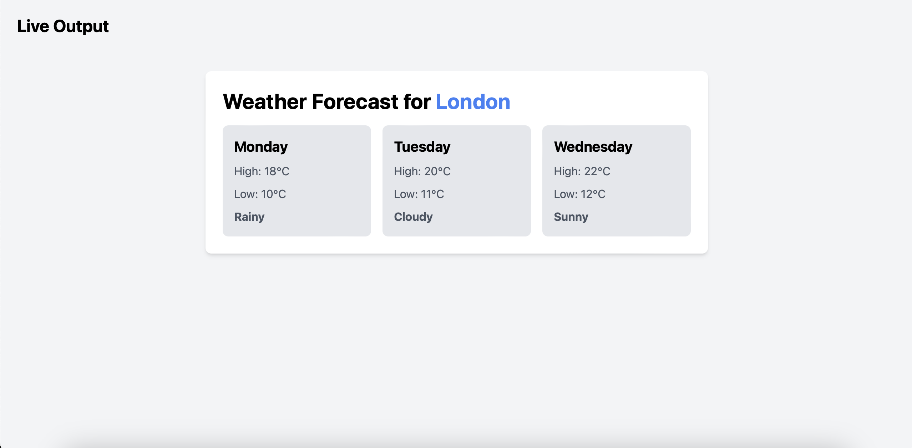
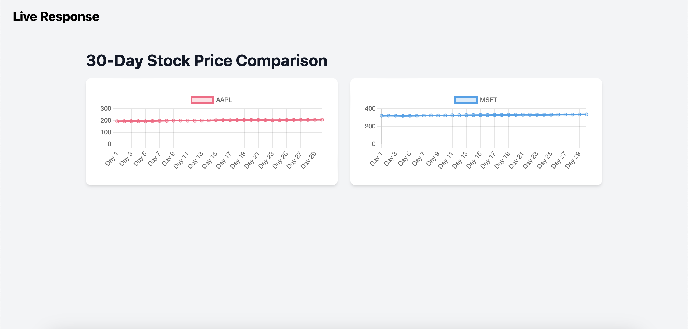
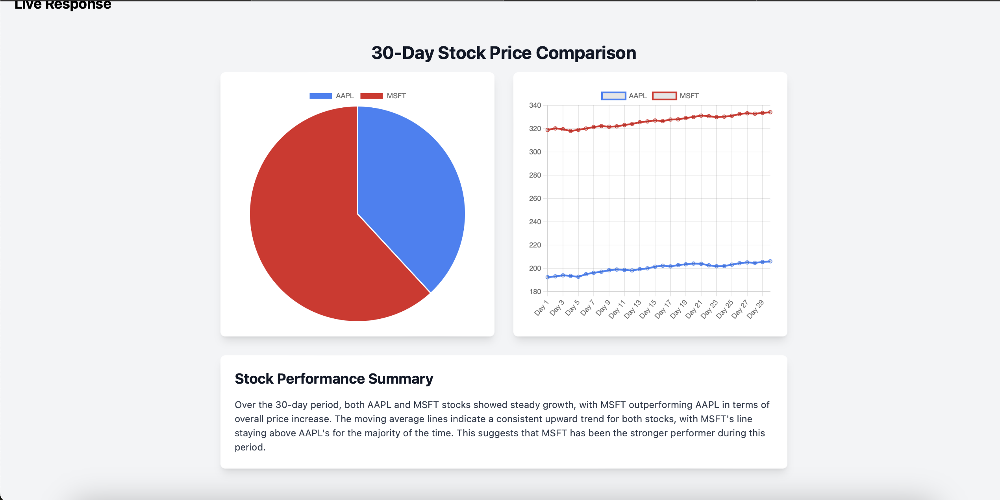

# Flask LLM Renderer

## Overview

Another project on my journey to never write frontend code again. This is a decorator for Flask that allows you to render HTML from any recieved json response to a HTML page, that is updated in real-time to a server through websockets. (99 percent of this project was spent refining the html prompt :D)

## Installation
We can either `pip install flask_llm_renderer` the package from PyPI or clone the repository and install it manually:
```bash
pip install build
python -m build
pip install dist/*.whl
```

## Example Usage

```python
python examples/example.py
```

You should be able to access the example at `http://localhost:5000/`. The example uses a simple Flask app that renders an initially empty page.

After you can curl a request to dynamically render an llm generated HTML page:

```bash
curl -X POST http://127.0.0.1:5000/render \
  -H "Content-Type: application/json" \
  -d '{
    "prompt": {
      "location": "London",
      "forecast": [
        {"day": "Monday", "high": 18, "low": 10, "condition": "Rainy"},
        {"day": "Tuesday", "high": 20, "low": 11, "condition": "Cloudy"},
        {"day": "Wednesday", "high": 22, "low": 12, "condition": "Sunny"}
      ]
    }
  }'
```

you should see something like this in your browser: 

Another example is:

```bash
curl -X POST http://127.0.0.1:5000/render \
  -H "Content-Type: application/json" \
  -d '{
    "title": "30-Day Stock Price Comparison",
    "stocks": [
      {
        "symbol": "AAPL",
        "prices": [192.4, 193.1, 194.0, 193.5, 192.8, 195.0, 196.2, 197.1, 198.4, 199.0, 198.7, 198.2, 199.3, 200.0, 201.4, 202.3, 201.7, 202.8, 203.5, 204.1, 203.9, 202.6, 201.8, 202.0, 203.2, 204.4, 205.1, 204.7, 205.5, 206.0]
      },
      {
        "symbol": "MSFT",
        "prices": [318.9, 320.2, 319.5, 318.0, 319.0, 320.1, 321.4, 322.2, 321.6, 322.0, 323.1, 324.0, 325.5, 326.2, 327.0, 326.5, 327.8, 328.0, 329.1, 330.0, 331.2, 330.7, 329.9, 330.3, 331.0, 332.5, 333.2, 332.8, 333.5, 334.1]
      }
    ],
    "dates": [
      "Day 1", "Day 2", "Day 3", "Day 4", "Day 5", "Day 6", "Day 7", "Day 8", "Day 9", "Day 10",
      "Day 11", "Day 12", "Day 13", "Day 14", "Day 15", "Day 16", "Day 17", "Day 18", "Day 19", "Day 20",
      "Day 21", "Day 22", "Day 23", "Day 24", "Day 25", "Day 26", "Day 27", "Day 28", "Day 29", "Day 30"
    ]
  }'
```

You should see something like this in your browser: 

If you want specific styling, you can add extra detail in the 'extra-details' field in the json request:

```bash
curl -X POST http://127.0.0.1:5000/render \
  -H "Content-Type: application/json" \
  -d '{
    "title": "30-Day Stock Price Comparison",
    "stocks": [
      {
        "symbol": "AAPL",
        "prices": [192.4, 193.1, 194.0, 193.5, 192.8, 195.0, 196.2, 197.1, 198.4, 199.0, 198.7, 198.2, 199.3, 200.0, 201.4, 202.3, 201.7, 202.8, 203.5, 204.1, 203.9, 202.6, 201.8, 202.0, 203.2, 204.4, 205.1, 204.7, 205.5, 206.0]
      },
      {
        "symbol": "MSFT",
        "prices": [318.9, 320.2, 319.5, 318.0, 319.0, 320.1, 321.4, 322.2, 321.6, 322.0, 323.1, 324.0, 325.5, 326.2, 327.0, 326.5, 327.8, 328.0, 329.1, 330.0, 331.2, 330.7, 329.9, 330.3, 331.0, 332.5, 333.2, 332.8, 333.5, 334.1]
      }
    ],
    "dates": [
      "Day 1", "Day 2", "Day 3", "Day 4", "Day 5", "Day 6", "Day 7", "Day 8", "Day 9", "Day 10",
      "Day 11", "Day 12", "Day 13", "Day 14", "Day 15", "Day 16", "Day 17", "Day 18", "Day 19", "Day 20",
      "Day 21", "Day 22", "Day 23", "Day 24", "Day 25", "Day 26", "Day 27", "Day 28", "Day 29", "Day 30"
    ],
    "extra-details": "AT the top give me a pie chart of the prices of each stock (total is the pie) and slice it based on price of each stock, after plot me the moving average of both stocks below a chart of the stock prices. Use a blue line for AAPL and a red line for MSFT. Make sure the chart is clear and easy to read. Then give me a wuick summary on the stock performance over the 30 days, highlighting any significant trends or patterns."
  }'
```

You should see something like this in your browser: 